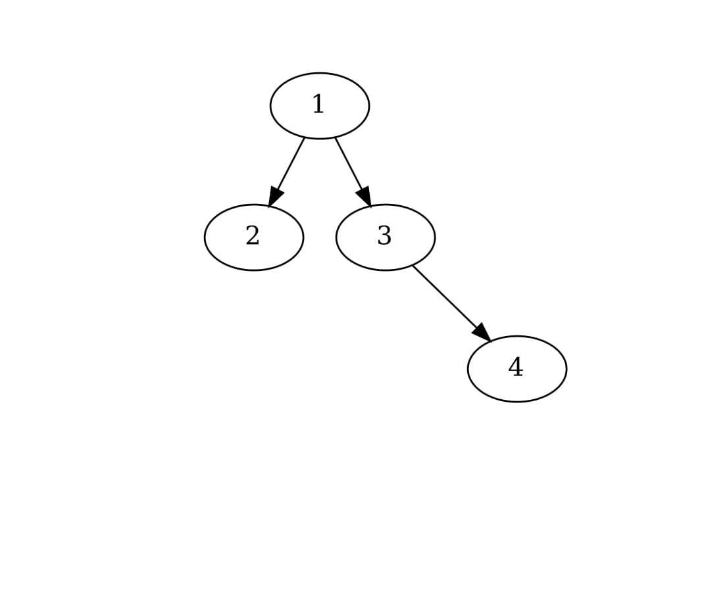
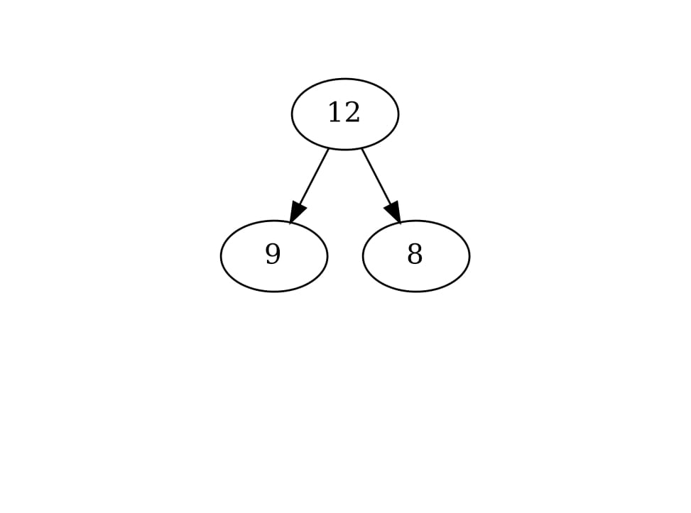
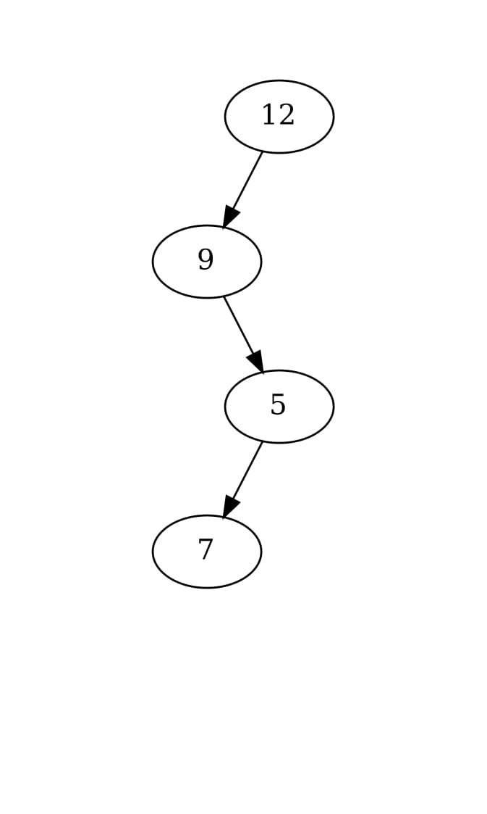
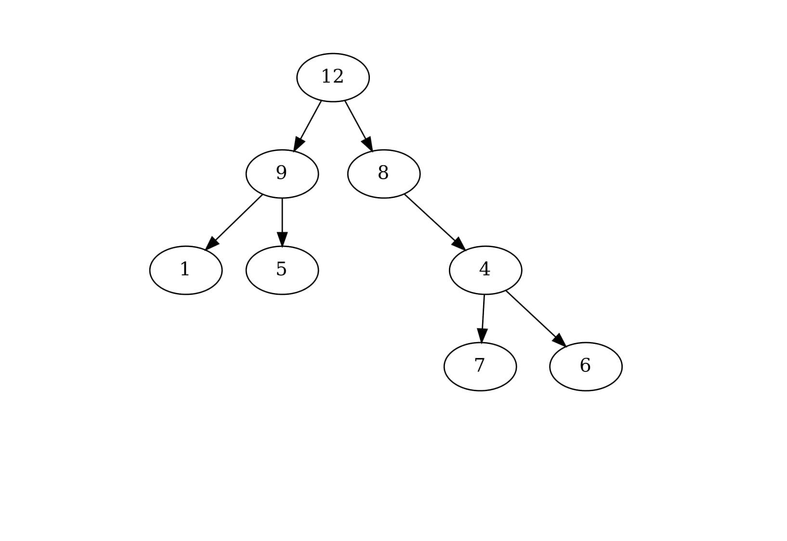
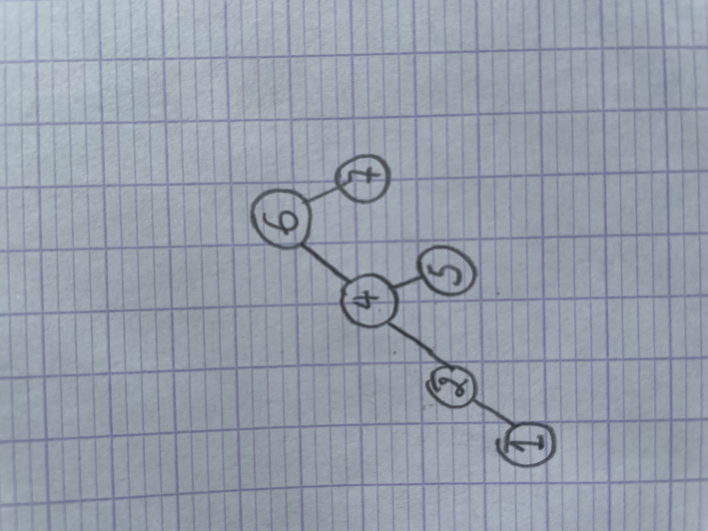

-----------------
tp-arbresbinaires
-----------------

~~~~~~~~~~
Etat du TP
~~~~~~~~~~

Décrivez ici l'état d'avancement du TP.

~~~~~~~~~~~~~~~~~~~~~~
Réponses aux questions
~~~~~~~~~~~~~~~~~~~~~~

Toutes les fonctions à réaliser ont bien été implanté pour ce TP.
Nous avons ajouté la fonction nbComp.

~~~~~~~~~~~~~~~~~~~~~~~~~~~~~~~~~~~~~~~
5.1.1 Vérification des arbre produits
~~~~~~~~~~~~~~~~~~~~~~~~~~~~~~~~~~~~~~~
La verification des arbres à été bien faite.

~~~~~~~~~~~~~~~~~~~~~~
5.2.1 Creation d'arbre
~~~~~~~~~~~~~~~~~~~~~~

Le code des trois fonctions ont ete codés :code:`arbre1` , :code:`arbre2` puis :code:`arbre3` a ete bien ecrit dans le fichier *test_arbre.c*
Et voici les arbres produits.

- Arbre 1

- Arbre 2

- Arbre 3

Question 5.2.4
--------------
Nous avons implémenté la fonction testNbAbres. Pour calculer le nombre d'arbre possible pour n allant de 0 à 19.

Question 5.2.5
--------------

Le calcul est long car on a des appelles qui se répetent beaucoup

Question 5.3.1
--------------

Ci dessous l'arbre binaire de recherche obtenu lorsqu'on part d'un arbre binaire de recheche vide et qu'on y insère 
les valeurs : 6, 4, 2, 7, 5 puis 1.

Question 5.3.2
--------------
La fonction :code:`abr1` a été bien construite.

Question 5.3.2
--------------

Pour s’assurer (simplement) que les arbres construits sont bien des arbres binaires de recherche, on peut effectuer un parcours 
infixe sur l'arbre et si les valeurs sont lister dans un ordre croissant, alors l'arbre obtenu est bien un arbre binaire de recherche.

Question 5.3.4
--------------
La fonction :code:`ajouter` a été bien construite.

Question 5.3.5
--------------

Les fonctions **abr2** et **abre3** ont été implementées.

Question 5.3.6/7
----------------

La fonction **appartient ** a été implementée et modifier pour pouvoir compter le nombre de comparaison effectué, Pour l'arbre 3 il est logique qu'il y est moins de comparaisons car 0 étant la plus petite valeur il suffit de vérifier à chaque fois à gauche et vu que pour l'arbre la hauteur du noeud le plus à gauche est de 2.

Question 5.3.8
--------------
Les fonctions **valeur_minimale** et **valeur_maximale** ont été bien implanté. 
Pour la plus petite valeur on se dirige vers le plus à gauche. Pour la plus grande on se dirige le plus à droite.

Question 5.4.2
--------------

Pour la réalisation de la fonction jouer() on a fait en sorte que nous indiquons à l'ordinateur si le chiffre qu'il nous donne est trop grand ou trop petit voir c'est celui recherché.
(On en a parlé avec vous).